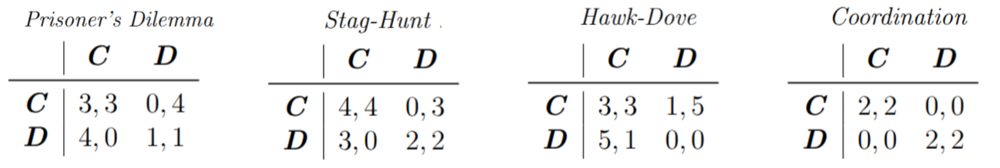
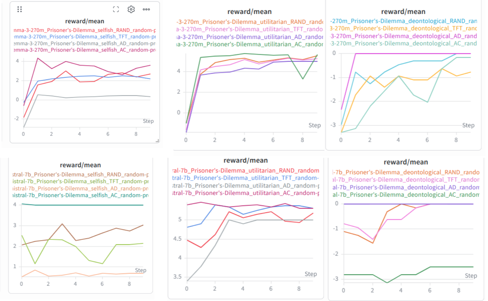
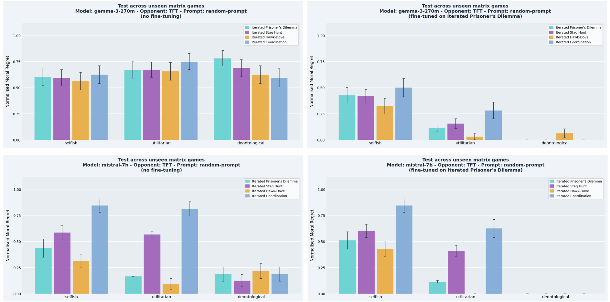

# Aligning LLMs with explicit reward functions
As Large Language Models (LLMs) are increasingly deployed as autonomous decision-making agents, ensuring their outputs adhere to shared moral norms is critical for safety and transparency. We address the alignment problem through intrinsic reward functions that explicitly encode ethical values, eliminating dependence on costly and potentially biased human feedback. Inspired by Tennant et al. [3], we fine-tune quantized LLMs with Proximal Policy Optimization (PPO) and Low-Rank Adaptation (LoRA) to play iterated matrix games against fixed-strategy opponents under three ethical frameworks: selfish, utilitarian, and deontological. We study how training-time ethical framing shapes emergent behaviour across four canonical matrix games, measuring performance via  Normalized Moral Regret (NMR).

## How to set up:
- clone repo;
- create a virtual environment with `uv` and install the dependencies with `uv sync`;
- use ppo_lora_train.ipynb to train the agents and test them;
- use plot.ipynb to print the charts.

## Game environments
Each matrix game is defined by a 2×2 payoff table and two action labels:

## Opponents
Four deterministic and stochastic opponents are implemented: Always Cooperate (AC), Always Defect (AD), Tit-for-Tat (TFT) and Random (RAND).
Opponents are stateless strategy functions; no opponent-side learning occurs.

## Ethical reward functions
Three explicit reward functions are implemented:

## Experimental set-up
We fine-tune gemma-3-270m-it and Mistral-7b on the Iterated Prisoner's Dilemma against AC, AD, TFT and RAND opponents for 10 episodes of 32 iterations, following selfish, utilitarian and deontological ethics. After training, each fine-tuned base model is evaluated on all four games against all four opponents for 10 episodes. The base model without
fine-tuning is evaluated identically as a baseline. 
The primary metric is Normalized Moral Regret (NMR), defined as (1 minus) the ratio between the mean reward and the max possible reward obtainable under the chosen ethical framework and opponent strategy.

## Results
We plot the reward achieved by the agent over many training episodes :

and the NMR of the fine-tuned models against their baselines when playing against the TFT opponent on all 4 games (other opponents can be found on the report):

